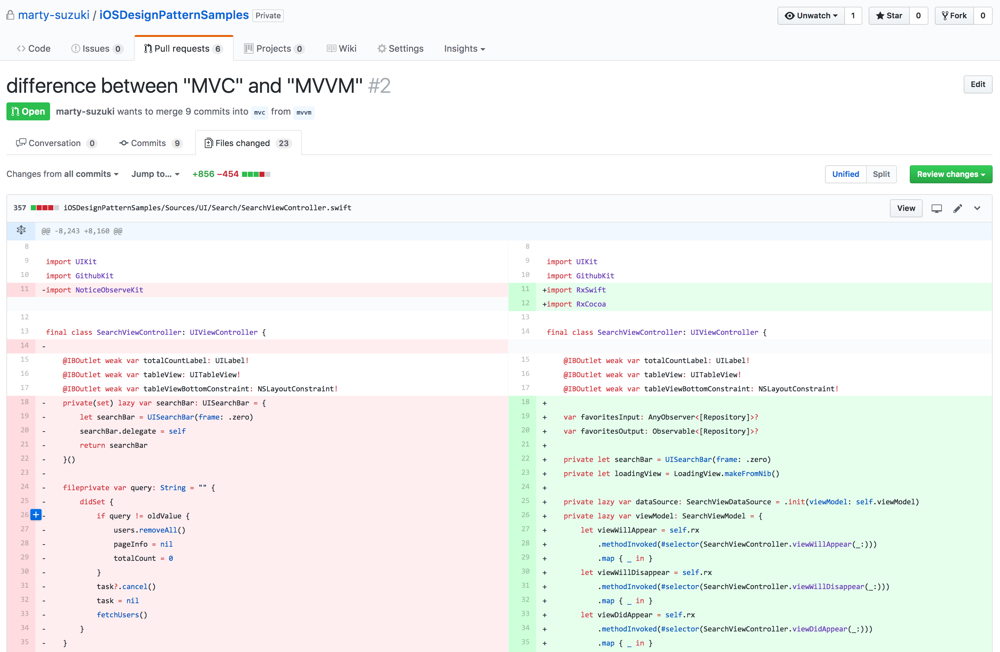

# iOSDesignPatternSamples

This is Github user search demo app which made by many variety of design patterns.


## Application Structure


- SearchViewController... Search Github user with query.
- UserRepositoryViewController... Show repositories of user who selected in SearchViewController.
- RepositoryViewController... Show a repository which selected in UserRepositoryViewController or FavoriteViewController. In addition, add / remove favorite repositories on memory.
- FavoriteViewController... Show favorite repositories which stored on memory.

## Design Patterns

- ### [MVC](https://github.com/marty-suzuki/iOSDesignPatternSamples/tree/mvc)
- ### [MVP](https://github.com/marty-suzuki/iOSDesignPatternSamples/tree/mvp)
- ### [MVVM](https://github.com/marty-suzuki/iOSDesignPatternSamples/tree/mvvm)
- ### [Flux](https://github.com/marty-suzuki/iOSDesignPatternSamples/tree/flux)

## Difference between A to B

|A / B|MVC|MVP|MVVM|Flux|
|:-:|:-:|:-:|:-:|:-:|
|MVC|-|[diff](https://github.com/marty-suzuki/iOSDesignPatternSamples/pull/1/files)|[diff](https://github.com/marty-suzuki/iOSDesignPatternSamples/pull/2/files)|[diff](https://github.com/marty-suzuki/iOSDesignPatternSamples/pull/3/files)|
|MVP|-|-|[diff](https://github.com/marty-suzuki/iOSDesignPatternSamples/pull/4/files)|[diff](https://github.com/marty-suzuki/iOSDesignPatternSamples/pull/5/files)|
|MVVM|-|-|-|[diff](https://github.com/marty-suzuki/iOSDesignPatternSamples/pull/6/files)|

You can compare differences like this.



## Run

To run this example, you need `carthage update`.

In addition, you need to set `Github Personal Access Token` like this.

```swift
func application(_ application: UIApplication, didFinishLaunchingWithOptions launchOptions: [UIApplicationLaunchOptionsKey: Any]?) -> Bool {
    // Override point for customization after application launch.

    ApiSession.shared.token = "Your Github Personal Access Token" // <- here

    //...
    return true
}
```

## Requirements

- Xcode 9 GM seed or later
- iOS 11 GM seed or later
- Swift 4 or later

## Other

This sample uses [FluxCapacitor](https://github.com/marty-suzuki/FluxCapacitor) and  [GithubKitForSample](https://github.com/marty-suzuki/GithubKitForSample) that make to create demo app easily.

## Author

marty-suzuki, s1180183@gmail.com

## License

iOSDesignPatternSamples is available under the MIT license. See the LICENSE file for more info.
