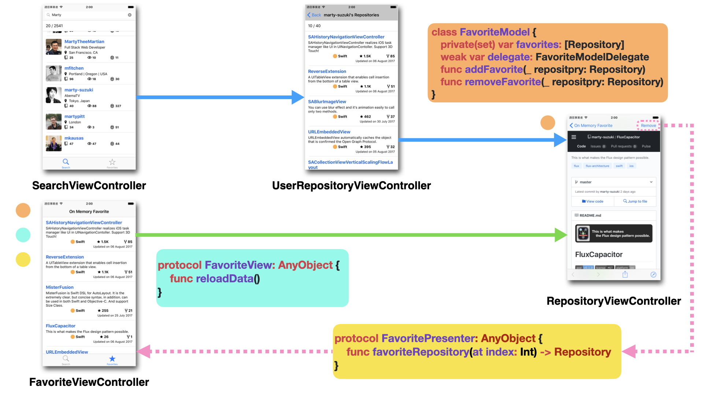

# iOSDesignPatternSamples (MVC)

This is Github user search demo app that made with MVC design pattern.

## Application Structure



## ViewControllers

- [SearchViewController](./iOSDesignPatternSamples/Sources/UI/Search/SearchViewController.swift) -> Search Github user and show user result list
- [FavoriteViewController](./iOSDesignPatternSamples/Sources/UI/Favorite/FavoriteViewController.swift) -> Show local on memory favorite repositories
- [UserRepositoryViewController](./iOSDesignPatternSamples/Sources/UI/UserRepository/UserRepositoryViewController.swift) -> Show Github user's repositories
- [RepositoryViewController](./iOSDesignPatternSamples/Sources/UI/Repository/RepositoryViewController.swift) -> Show a repository and add / remove local on memory favorites

## How to add / remove favorites

You can add / remove favorite repositories in RepositoryViewController, but an Array of favorite repository is hold by FavoriteViewController.

## Run

To run this example, you need `make install`.

In addition, you need to set `Github Personal Access Token` like this.

```swift
extension ApiSession {
    static let shared: ApiSession = {
        let token = "" // <- Your Github Personal Access Token
        return ApiSession(injectToken: { InjectableToken(token: token) })
    }()
}
```

## Requirements

- Xcode 10.1 or later
- iOS 11 or later
- Swift 4.2 or later

## Special Thanks

- [RxSwift](https://github.com/ReactiveX/RxSwift)
- [Nuke](https://github.com/kean/Nuke)
- [SwiftIconFont](https://github.com/0x73/SwiftIconFont)
- [FluxCapacitor](https://github.com/marty-suzuki/FluxCapacitor)
- [GithubKitForSample](https://github.com/marty-suzuki/GithubKitForSample)
- [NoticeObserveKit](https://github.com/marty-suzuki/NoticeObserveKit)

## Author

marty-suzuki, s1180183@gmail.com

## License

iOSDesignPatternSamples is available under the MIT license. See the LICENSE file for more info.
