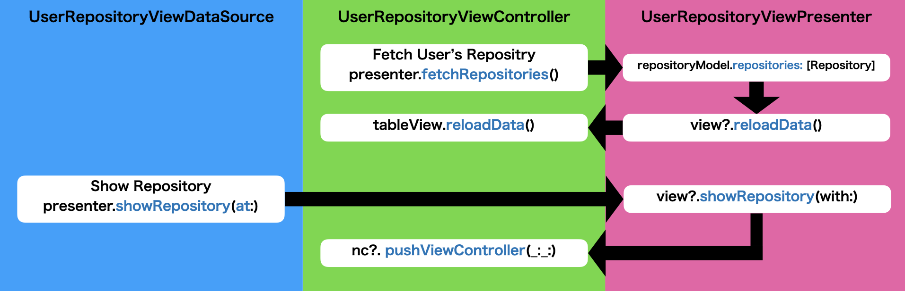
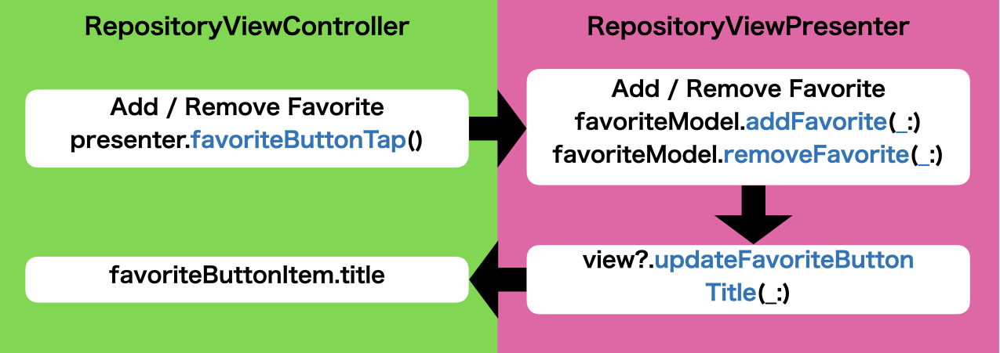

# iOSDesignPatternSamples (Flux)

This is Github user search demo app that made with Flux design pattern.

## Application Structure


## ViewControllers

### [SearchViewController](./iOSDesignPatternSamples/Sources/UI/Search/SearchViewController.swift)
Search Github user and show user result list


- [SearchViewDataSource](./iOSDesignPatternSamples/Sources/UI/Search/SearchViewDataSource.swift) <- Adapt UITableViewDataSource and UITableViewDelegate
- [SearchAction](./iOSDesignPatternSamples/Sources/UI/Search/Flux/SearchAction.swift)
- [SearchStore](./iOSDesignPatternSamples/Sources/UI/Search/Flux/SearchStore.swift)

### [FavoriteViewController](./iOSDesignPatternSamples/Sources/UI/Favorite/FavoriteViewController.swift)
Show local on memory favorite repositories


- [FavoriteViewDataSource](./iOSDesignPatternSamples/Sources/UI/Favorite/FavoriteViewDataSource.swift) <- Adapt UITableViewDataSource and UITableViewDelegate
- [FavoriteAction](./iOSDesignPatternSamples/Sources/UI/Favorite/Flux/FavoriteAction.swift)
- [FavoriteStore](./iOSDesignPatternSamples/Sources/UI/Favorite/Flux/FavoriteStore.swift)

### [UserRepositoryViewController](./iOSDesignPatternSamples/Sources/UI/UserRepository/UserRepositoryViewController.swift)
Show Github user's repositories



- [UserRepositoryViewDataSource](./iOSDesignPatternSamples/Sources/UI/UserRepository/UserRepositoryViewDataSource.swift) <- Adapt UITableViewDataSource and UITableViewDelegate
- [UserRepositoryAction](./iOSDesignPatternSamples/Sources/UI/UserRepository/Flux/UserRepositoryAction.swift)
- [UserRepositoryStore](./iOSDesignPatternSamples/Sources/UI/UserRepository/Flux/UserRepositoryStore.swift)

### [RepositoryViewController](./iOSDesignPatternSamples/Sources/UI/Repository/RepositoryViewController.swift)
Show a repository and add / remove local on memory favorites



- [RepositoryAction](./iOSDesignPatternSamples/Sources/UI/Repository/Flux/RepositoryAction.swift)
- [RepositoryStore](./iOSDesignPatternSamples/Sources/UI/Repository/Flux/RepositoryStore.swift)


## How to add / remove favorites

You can add / remove favorite repositories in RepositoryViewController. Array of favorite repository is hold by FavoriteModel that injected to each actions, therefore you can use its reference everywhere!

## Run

You need to set `Github Personal Access Token` like this.

```swift
extension ApiSession {
    static let shared: ApiSession = {
        let token = "" // <- Your Github Personal Access Token
        return ApiSession(injectToken: { InjectableToken(token: token) })
    }()
}
```

## Requirements

- Xcode 12 or later
- iOS 13 or later
- Swift 5 or later

## Special Thanks

- [GithubKitForSample](https://github.com/marty-suzuki/GithubKitForSample)

## Author

marty-suzuki, s1180183@gmail.com

## License

iOSDesignPatternSamples is available under the MIT license. See the LICENSE file for more info.
